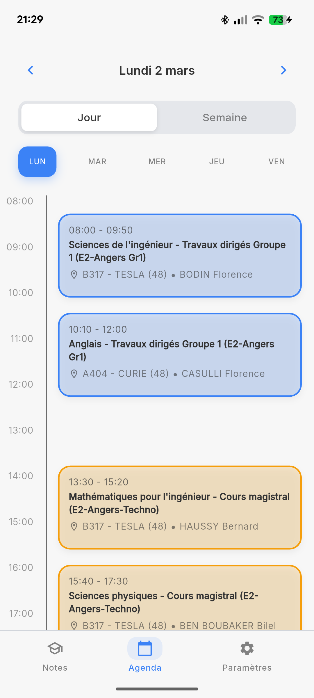
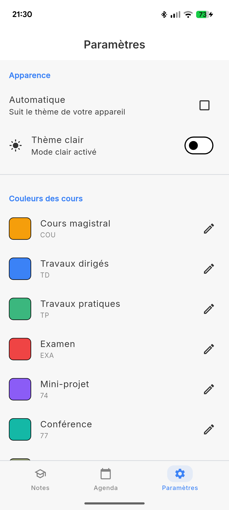
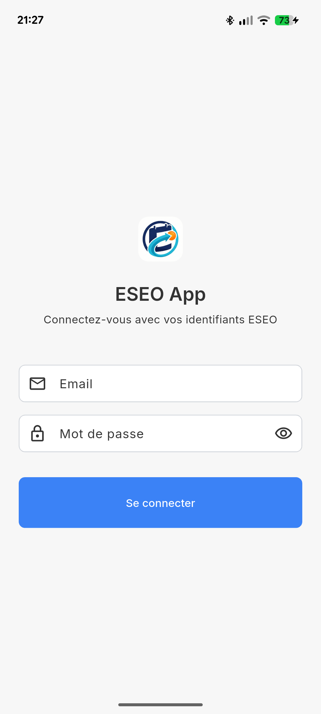

# 📅 EDT App - Application Emploi du Temps ESEO

<div align="center">

[](https://flutter.dev)
[](https://dart.dev)
[](LICENSE)

Application mobile Flutter moderne pour consulter l'emploi du temps ESEO avec synchronisation en temps réel.

[Fonctionnalités](#-fonctionnalités) • [Installation](#-installation) • [Screenshots](#-screenshots) • [Architecture](#-architecture)

</div>

---

## ✨ Fonctionnalités

### 📱 Vues de l'emploi du temps
- **Vue Jour** : Timeline verticale avec horaires détaillés (8h-18h)
- **Vue Semaine** : Vue compacte de la semaine complète (Lundi-Vendredi)
- Navigation fluide entre les jours et semaines
- Sélecteur de date pour accès rapide

### 🎨 Personnalisation avancée
- **4 styles d'événements** :
  - Barre gauche (minimal)
  - Rempli (coloré)
  - Contour (épuré)
  - Rempli clair (subtil)
- **Couleurs personnalisables** par type de cours (CM, TD, TP, etc.)
- **Thèmes** : Clair, Sombre, ou Automatique selon le système
- Interface Material Design 3

### ⏰ Indicateur de temps intelligent
- Ligne rouge indiquant l'heure actuelle
- Options d'affichage :
  - Toujours visible
  - Uniquement le jour actuel
- Positionnement pixel-perfect aligné avec la timeline

### 🔄 Synchronisation et données
- Chargement intelligent par périodes de 3 mois
- Extension automatique jusqu'à 1 an de données
- Cache intelligent (1 heure)
- Pull-to-refresh pour mise à jour manuelle
- Navigation illimitée dans le temps

### 🔐 Authentification et sécurité
- Connexion sécurisée avec identifiants ESEO
- JWT stocké avec `flutter_secure_storage`
- Déconnexion et gestion de session

### 📱 Notifications (Optionnel)
- Notifications push via Firebase Cloud Messaging
- Alertes pour les cours à venir

---

## 📸 Screenshots

<div align="center">

| Vue Jour | Vue Semaine | Paramètres |
|----------|-------------|------------|
|  |  |  |

| Détails Cours | Thème Sombre | Connexion |
|---------------|--------------|-----------|
|  |  |  |

</div>

---

## 🏗️ Architecture

```
lib/
├── main.dart                      # Point d'entrée de l'application
├── config/
│   ├── api_config.dart           # Configuration de l'API backend
│   ├── app_theme.dart            # Thèmes clair et sombre
│   └── event_style.dart          # Styles d'affichage des événements
├── models/
│   └── schedule_event.dart       # Modèle de données des cours
├── services/
│   ├── api_service.dart          # Client HTTP pour l'API
│   ├── auth_service.dart         # Gestion de l'authentification
│   ├── preferences_service.dart  # Stockage des préférences
│   └── notification_service.dart # Notifications push (Firebase)
├── providers/
│   ├── auth_provider.dart        # État d'authentification
│   ├── schedule_provider.dart    # État de l'emploi du temps
│   └── settings_provider.dart    # État des paramètres
├── screens/
│   ├── login_screen.dart         # Écran de connexion
│   ├── schedule_tab.dart         # Onglet emploi du temps
│   ├── notes_tab.dart            # Onglet notes (à venir)
│   └── settings_tab.dart         # Onglet paramètres
└── widgets/
    ├── timeline_day_view.dart    # Vue jour avec timeline
    ├── week_calendar_view.dart   # Vue semaine compacte
    ├── schedule_header.dart      # En-tête avec navigation
    └── empty_schedule_state.dart # État vide
```

---

## 🚀 Installation

### Prérequis

- **Flutter SDK** 3.0 ou supérieur
- **Dart** 3.0 ou supérieur
- **Backend FastAPI** en cours d'exécution (voir [backend repository](#))
- **Firebase Project** (optionnel, pour les notifications)

### 1. Cloner le repository

```bash
git clone https://github.com/votre-username/edt_app_flutter.git
cd edt_app_flutter
```

### 2. Installer les dépendances

```bash
flutter pub get
```

### 3. Configuration de l'API

Modifiez `lib/config/api_config.dart` selon votre environnement :

```dart
class ApiConfig {
  // Android Emulator
  static const String baseUrl = 'http://10.0.2.2:8000';

  // iOS Simulator
  static const String baseUrl = 'http://localhost:8000';

  // Device réel (utilisez l'IP de votre machine)
  static const String baseUrl = 'http://192.168.1.X:8000';
}
```

### 4. Configuration Firebase (Optionnel)

#### Android

1. Créer un projet sur [Firebase Console](https://console.firebase.google.com)
2. Ajouter une application Android
3. Télécharger `google-services.json`
4. Placer dans `android/app/google-services.json`

#### iOS

1. Dans Firebase Console, ajouter une application iOS
2. Télécharger `GoogleService-Info.plist`
3. Placer dans `ios/Runner/GoogleService-Info.plist`

### 5. Lancer l'application

```bash
# Android
flutter run

# iOS (macOS uniquement)
flutter run -d ios

# Device spécifique
flutter devices
flutter run -d <device_id>
```

---

## 📦 Dépendances principales

| Package | Version | Usage |
|---------|---------|-------|
| `provider` | ^6.0.0 | Gestion d'état |
| `http` | ^1.1.0 | Requêtes HTTP |
| `flutter_secure_storage` | ^9.0.0 | Stockage sécurisé JWT |
| `firebase_core` | ^2.24.0 | Firebase Core |
| `firebase_messaging` | ^14.7.0 | Notifications push |
| `intl` | ^0.18.0 | Formatage dates (français) |
| `google_fonts` | ^6.1.0 | Fonts personnalisées |

---

## 🎯 Utilisation

### Connexion

1. Lancer l'application
2. Entrer vos identifiants ESEO (email Microsoft + mot de passe)
3. Cliquer sur "Se connecter"

### Navigation

- **Swipe gauche/droite** : Changer de jour (vue jour)
- **Flèches** : Navigation jour/semaine
- **Bouton "Aujourd'hui"** : Retour à la date actuelle
- **Icône calendrier** : Sélecteur de date
- **Pull-to-refresh** : Rafraîchir les données

### Personnalisation

1. Aller dans l'onglet **Paramètres**
2. Choisir le **thème** (Clair/Sombre/Auto)
3. Sélectionner le **style d'événements**
4. Personnaliser les **couleurs des cours**
5. Configurer l'**indicateur de temps**

---

## 🔧 Configuration avancée

### API Backend

L'application communique avec un backend FastAPI. Endpoints utilisés :

```
POST   /auth/login          # Authentification
GET    /agenda              # Emploi du temps (4 semaines par défaut)
GET    /agenda?start=...    # Emploi du temps avec dates personnalisées
POST   /fcm/token           # Enregistrer le token FCM
```

#### Paramètres de date

L'API supporte des plages de dates flexibles :

```bash
# 4 semaines par défaut
GET /agenda

# 8 semaines spécifiques
GET /agenda?start=2026-02-09&end=2026-04-06

# 6 mois
GET /agenda?start=2026-02-09&end=2026-08-09

# Maximum : 1 an
GET /agenda?start=2026-02-09&end=2027-02-09
```

### Stockage local

Les données suivantes sont stockées localement :

- **Secure Storage** (chiffré) :
  - JWT Token
  - Refresh Token

- **Shared Preferences** :
  - Thème sélectionné
  - Style d'événements
  - Couleurs personnalisées
  - Préférences d'affichage

---

## 🐛 Troubleshooting

### Erreur de connexion au backend

- ✅ Vérifier que le backend est lancé (port 8000)
- ✅ Vérifier l'URL dans `api_config.dart`
- ✅ Sur Android Emulator, utiliser `10.0.2.2` au lieu de `localhost`
- ✅ Vérifier les CORS sur le backend

### Firebase n'initialise pas

- ✅ Vérifier la présence de `google-services.json` (Android)
- ✅ Vérifier la présence de `GoogleService-Info.plist` (iOS)
- ✅ Vérifier le package name/bundle ID

### Indicateur de temps mal aligné

- ✅ L'indicateur est calibré pour un `hourHeight` de 80px
- ✅ Vérifier que `startHour = 8` et `endHour = 18`
- ✅ Le padding top doit être de 24px

### Données non chargées

- ✅ Vérifier la connexion internet
- ✅ Vérifier que le token JWT est valide
- ✅ Vider le cache : se déconnecter puis se reconnecter

---

## 🏗️ Build de production

### Android

```bash
# APK
flutter build apk --release

# App Bundle (pour Google Play)
flutter build appbundle --release
```

Les fichiers sont générés dans :
- APK : `build/app/outputs/flutter-apk/app-release.apk`
- AAB : `build/app/outputs/bundle/release/app-release.aab`

### iOS

```bash
flutter build ios --release
```

Ensuite, ouvrir Xcode pour l'archivage et la distribution.

---

## 🗺️ Roadmap

- [x] Authentification sécurisée
- [x] Vue jour avec timeline
- [x] Vue semaine compacte
- [x] Personnalisation des couleurs
- [x] Thème sombre
- [x] Indicateur de temps actuel
- [x] Chargement par périodes étendues
- [ ] Mode hors-ligne avec cache local
- [ ] Export calendrier (iCal/Google Calendar)
- [ ] Widget homescreen
- [ ] Page Notes avec consultation des notes
- [ ] Filtres sur l'emploi du temps
- [ ] Notifications intelligentes (rappels avant cours)

---

## 🤝 Contribution

Les contributions sont les bienvenues ! Pour contribuer :

1. Fork le projet
2. Créer une branche (`git checkout -b feature/AmazingFeature`)
3. Commit les changements (`git commit -m 'Add AmazingFeature'`)
4. Push vers la branche (`git push origin feature/AmazingFeature`)
5. Ouvrir une Pull Request

---

## 📝 License

Ce projet est sous licence MIT. Voir le fichier [LICENSE](LICENSE) pour plus de détails.

---

## 👥 Auteurs

- **Votre Nom** - *Développement initial* - [@votre-username](https://github.com/votre-username)

---

## 🙏 Remerciements

- ESEO pour l'infrastructure backend
- Flutter team pour le framework
- Google Fonts pour les polices
- Firebase pour les notifications

---

<div align="center">

**Fait avec ❤️ et Flutter**

[⬆ Retour en haut](#-edt-app---application-emploi-du-temps-eseo)

</div>
